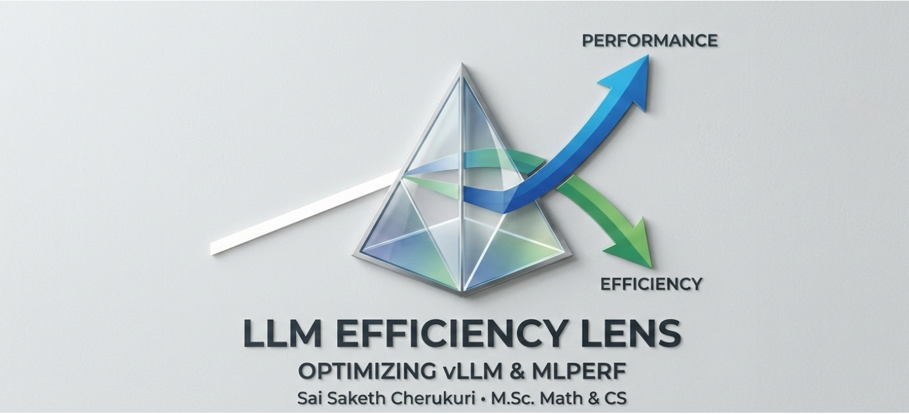

# LLM Efficiency Lens 



[](https://opensource.org/licenses/Apache-2.0)
[](https://www.python.org/downloads/)
[](https://github.com/vllm-project/vllm)
[](https://mlcommons.org/)

**LLM Efficiency Lens** is an open-source framework that correlates raw inference performance with real-world economic efficiency. By bridging the gap between **MLPerf** technical benchmarks and cloud infrastructure costs, we empower developers to make sustainable, cost-effective deployment decisions.

---

##  The Vision
Born out of a deep-seated passion for the open-source ecosystem, this project is more than just a tool—it is a contribution to the community. We believe that as AI scales, transparency in "Performance per Dollar" should be a right, not a luxury. 

This project aims to provide the community with a mathematically rigorous yet accessible way to optimize Large Language Models (LLMs) like **Llama 3.1-8B** on the **vLLM** engine.

---

##  Purpose & Scope

### Purpose
To provide a standardized methodology for measuring the **Economic ROI** of LLM inference, moving beyond simple throughput (tokens/sec) to actionable financial metrics.

### Scope
* **Benchmark Support**: Initial focus on MLPerf Inference LoadGen logs.
* **Inference Engines**: Native support for vLLM performance metrics.
* **Model Focus**: High-fidelity analysis for Llama 3.1 (8B/70B) and similar architectures.
* **Hardware Metadata**: Automated cost correlation with major cloud providers (AWS, Lambda Labs, GCP).

---

##  The Challenge
The AI industry currently faces a "Benchmark Gap":
1. **Raw Speed vs. ROI**: Engineers know how fast a model is, but not how much it costs per million tokens at scale.
2. **Quantization Complexity**: Choosing between FP16, AWQ, or FP8 is often a guessing game regarding the trade-off between latency and hardware power consumption.
3. **Log Fragmentation**: MLPerf logs are data-rich but difficult to parse into high-level business insights.

---

## The Solution: A Mathematical Lens
Using a rigorous approach rooted in **Mathematics and Computer Science**, LLM Efficiency Lens provides:
1. **Automated Log Parsing**: Converts complex MLPerf summary/detail logs into structured data.
2. **Pareto Optimization**: Visualizes the optimal frontier where performance meets cost-efficiency.
3. **Economic Forecasting**: Maps inference benchmarks to real-world cloud pricing metadata.
4. **Community Intelligence**: A shared, open-source database of hardware performance-to-cost ratios.

---
Quick Start & Run Analysis
1. Install Dependencies
Ensure you have Python 3.10+ installed, then run:
pip install -r requirements.txt

2. Perform Economic Analysis
Correlate your benchmark results with cloud costs using the built-in analyzer:

## from src.parser.analyzer import EfficiencyAnalyzer

# Initialize with the metadata database
analyzer = EfficiencyAnalyzer(pricing_path="metadata/cloud_pricing.json")

# Correlate 4500.5 Tokens/Sec with Lambda Labs H100 pricing
report = analyzer.calculate_economics(
    throughput_tps=4500.5, 
    provider="lambda_labs", 
    gpu_instance="h100_pcie"
)

print(f"Analysis for: {report['config']}")
print(f"Tokens per Dollar: {report['tokens_per_dollar']}")
print(f"Cost per 1M Tokens: ${report['cost_per_1m_tokens_usd']}")

---
Roadmap
[ ] Phase 1 (March 2026): Finalize vLLM/MLPerf automated log ingestion.

[ ] Phase 2 (May 2026): Launch Streamlit Dashboard for Pareto Frontier visualization.

[ ] Phase 3 (July 2026): Add support for TensorRT-LLM and TGI engines.

[ ] Phase 4: Community-driven hardware pricing API integration.


---
##  Community & Contribution
This project is in active development as part of an M.Sc. thesis and a proposal for Open Source Summit India 2026. We welcome the community to join us:

1. Add Pricing: Submit a PR with updated pricing for cloud or on-prem hardware.

2. New Parsers: Help us support TGI, TRT-LLM, or other inference backends.

3. Fix Bugs: Open an issue if you find an edge case in log parsing.

---

##  Passion
Developed by Sai Saketh Cherukuri, M.Sc. Mathematics & Computer Science. This project seeks to combine mathematical rigor with high-performance computing to build a more efficient and transparent AI future.
---
##  Project Structure
```text
llm-efficiency-lens/
├── data/
│   └── samples/              # Example MLPerf logs for Llama 3.1
├── metadata/
│   └── cloud_pricing.json    # Real-world hardware cost database
├── src/
│   ├── parser/               # Logic for reading MLPerf/vLLM logs
│   └── dashboard/            # Streamlit-based visualization UI
├── requirements.txt          # Python dependencies
└── LICENSE                   # Apache 2.0


